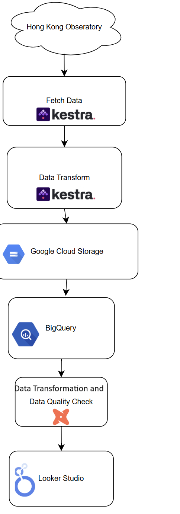

# Data Engineering Zoomcamp 2025 Project

## Overview

This [repository](https://github.com/urbanclimatefr/de-zoomcamp-2025-project-attempt2) hosts the source code and documentation for the 2025 project of the [Data Engineering Zoomcamp](https://github.com/DataTalksClub/data-engineering-zoomcamp)'s project for 2025.

The README content is also accessible at  [https://github.com/urbanclimatefr/de-zoomcamp-2025-project-attempt2](https://github.com/urbanclimatefr/de-zoomcamp-2025-project-attempt2)

# Key changes from first project attempt

1. Infrasture as Code with Terraform was adopted.
2. A 5 minute batch processing data pipeline with Kestra was implemented considering the suggestion from the feedback that a streaming data pipeline could be adopted with the real time API. However, it is challenging to build a real time streaming pipeline under limited time constraint.

3. Both temperature and humidty data were fetched from API, transformation was done by python pandas in Kestra, considering the difficulty in using native python kestra tool to transform the json data.

4. dbt transformation was included to handle the calculation of the Hong Kong Heat Index (inputs are temperature and humidity)

5. A third page is added for the Hong Kong Heat Index.

6. Explanation on clustering and partitioning strategy of the final destination table in Bigquery was added.

7. More elaboration on the overall architecture, tech stack and what each of them does, were added.

 

## Goal

The objective of this project is to develop an end-to-end batch data pipeline that includes ingestion, processing, transformation, persistence, and visualization. Utilizing data from the Hong Kong Observatory, users can access near real time temperature and Hong Kong heat index data (updated every 5 minutes) through a Looker Studio report.

 

## Data Source

**Hong Kong Observatory**'s [API Web Service](https://data.gov.hk/en-data/dataset/hk-hko-rss-current-weather-report/resource/923a02ae-4a14-4a28-8a2b-1215d3dff08f), which offers various APIs for collecting real-time weather data.

 

## Data Collection

Rather than using pre-existing historical data, this project will gather data hourly and establish a batch processing pipeline to handle the data daily. The processed data will then be displayed in dashboards created using Google Cloud's Looker Studio.

 

## Data Visualization

The culmination of this project is a **Weather Report** Looker report.

The initial page of the report displays summary statistics, allowing users to filter by **Station** and/or **Date**.

The first dashboard on this page indicates the number of records collected for the chosen station and date.

The second dashboard presents the lowest, average, and highest temperatures for the selected station and date.

 

 

The second page of the report illustrates the time series temperature data for the selected station and date range.

 

The third page of the report shows the Hong Kong heat index of various place in Hong Kong.
 

## Flowchart

 

 

## Data Pipelines

 

See [data pipelines](./doc/pipeline.md)

 

## Prerequisites

Before executing the pipeline, the necessary infrastructure must be provisioned.

**Infrasture as code with Terraform**

This involves creation of GCP storage, Bigquery infrasture as code

[Terraform](https://github.com/urbanclimatefr/de-zoomcamp-2025-project-attempt2/blob/main/doc/iac.md)

**Docker Container Creation**

This involves building a local Kestra image and running Kestra and Postgres containers.

Infrastructure Setup with Terraform

[Kestra](./doc/kestra.md)

 

## Lessons Learned

- Early decisions on data visualization help in defining the scope and the type of processing required for the pipeline. Starting from the desired end state and working backward is an effective strategy to maintain focus.

- Documentation can be as time-consuming as the development process itself.

